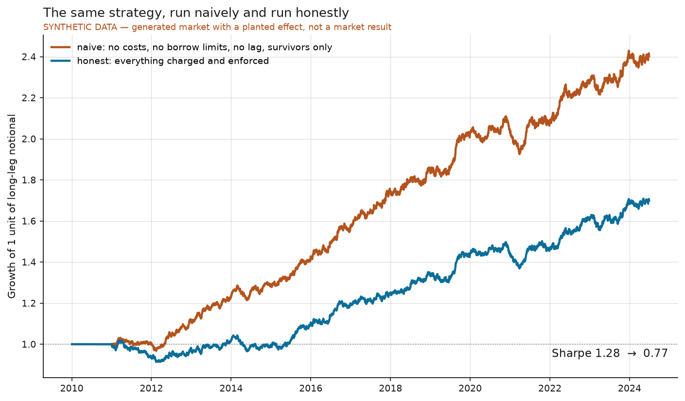

# honest-backtest

A vectorized cross-sectional backtester that refuses to flatter the user.



The two lines are the **same strategy on the same data**. The difference is
entirely in what the backtest was willing to charge it for.

> **The demo runs on synthetic data, and every chart says so.** This repository is
> about accounting, not alpha. A generated market with a *planted, known* effect lets
> the naive-versus-honest gap be checked against ground truth instead of guessed at.
> Real prices would make the demo prettier and the claim weaker — there would be no
> true answer to compare against. The engine is data-agnostic; point `MarketData` at
> real prices and nothing else changes.

- **40% of the Sharpe and 40% of the annual return disappear** when the same strategy
  is charged for what it actually does: 1.28 → **0.77**, and 6.0% → **3.6%** a year.
- **The biggest single lie is not trading costs.** Restricting the strategy to each
  date's *actual* universe membership costs **0.28 of Sharpe** on its own — more than
  commission, spread and market impact combined (0.15).
- **Borrow is the most expensive line item.** Stock borrow costs **0.89% a year**
  against **0.72%** for all three trading costs together. A short leg treated as free
  is a financing arrangement nobody offers.
- **The capacity estimate calls itself unreliable.** It reports $36.7bn and then sets
  `capacity_estimate_is_credible = False`, because the same run already trades **121%
  of one name's average daily volume**. The participation tail is an observation; the
  capacity figure extrapolates a fitted law 367-fold beyond its range.
- **Caveat:** two rungs of the realism ladder move the *wrong* way — enforcing
  hard-to-borrow (+0.01) and applying the reporting lag (+0.10). The lag helping is a
  real property of this sample, not a bug, and it is reported as it came out rather
  than reordered to look monotonic. These effects interact; the ladder is a
  decomposition, not six independent penalties.

## Quickstart

```bash
uv sync
uv run python scripts/fetch_data.py
uv run python scripts/run_study.py
```

No network access at any point. `fetch_data.py` generates the synthetic market from
the seed in `config/study.yaml`; `run_study.py` regenerates every figure and table in
`results/` in about 25 seconds. `uv run pytest` runs 56 tests; CI enforces 80%
line coverage.

CI does more than lint and test: it runs the full study and then fails if `results/`
has changed. The reproduction claim above is checked on every push rather than asserted.

## The API, in full

```python
from honest_backtest import Config, RealismConfig, Signal, load_config, run
from honest_backtest.study import build_market, momentum_builder

cfg = load_config()
market = build_market(cfg)

# from_builder refuses to construct if the builder can see the future.
signal = Signal.from_builder(momentum_builder(), market.closes, check_causality=True)

honest = run(market, signal, cfg)
naive = run(market, signal, cfg.with_realism(RealismConfig.naive()))

print(honest.caveat())  # "SYNTHETIC DATA"
print(naive.caveat())  # "... protections disabled: apply_costs, ..."
print(honest.net_return.mean(), honest.turnover.mean())
```

Note what is **not** in that snippet: you never pass returns, and you never choose an
alignment. Those are the two places a backtest usually starts lying, so they are not
arguments.

## What this does

**Point-in-time discipline by construction.** A `Signal`'s row `t` is known at the
close of `t` — there is no parameter to change that. The engine derives returns from
prices itself, applies the reporting lag itself, and executes on the *next* bar.
`Signal.from_builder` runs a causality check before returning: it recomputes your
signal on data whose future has been overwritten and refuses to construct if any past
value moved. Producing a look-ahead result requires deliberately handing the engine a
frame that already contains the future.

**Costs from actual turnover.** Commission and half-spread are linear in traded
notional; impact is `coefficient × √participation`, where participation is traded
shares over trailing ADV, per name per day. A name with no volume history is charged
at the participation cap, not at zero — being unable to measure liquidity is not
evidence that a trade was cheap. Borrow accrues **daily** on short notional from a
per-name tier, because it is the holding that costs money, not the trading.

**Shorting realism.** Hard-to-borrow names are removed from the short leg, the
remaining shorts absorb the exposure, and the blocked count is reported rather than
swallowed.

**Universe management.** Membership is an explicit boolean calendar. Names enter and
leave. A delisting has its terminal return applied on its final membership date —
the position is *resolved*, not deleted at its last observed price.

**Split-day return accounting.** On a rebalance day filled at the open, the day is
split: `old_weights · (open/prev_close − 1) + new_weights · (close/open − 1)`. You held
yesterday's book overnight and today's from the opening print. Charging the whole day
to the new weights would credit the strategy with an overnight move it had not yet
positioned for.

**Cost conservation as an identity.** `net = gross − commission − spread − impact −
borrow`, asserted rather than assumed. A component added without being wired into the
total raises an error instead of quietly appearing as alpha.

## Limitations

**The demo market is synthetic, so the *level* of every number here is meaningless.**
What is meaningful is the *gap* between the two configurations, which is a property of
the accounting rather than of the data. Do not quote 0.77 as a Sharpe anyone achieved.

**The ladder is order-dependent.** Enabling costs then borrow gives different
attributions than enabling borrow then costs, because the effects interact. The table
says "cumulative" for that reason. A Shapley decomposition would be fairer and is not
implemented.

**Delistings in the synthetic market are random.** In this generated data a delisting
is uncorrelated with past performance, so terminal losses wash out between the long and
short legs — which is why that rung of the ladder barely moves. In a real market
delistings concentrate among past losers, so the effect would be asymmetric and larger.
This is the single most important respect in which the demo understates the problem.

**Impact is a square-root law with an invented coefficient.** The functional form is
standard; the value of 10 is not calibrated against fills. It sets the *scale* of the
impact column, so treat that line as illustrative.

**No intraday modelling, no partial fills, no queue position.** Trades execute in full
at the open or close. This is a daily-bar, cross-sectional engine and it is not
pretending otherwise.

**Not an event-driven engine, not an order router, not a live trading system.** It
does one thing.

**Borrow tiers are assigned randomly in the demo.** Real borrow cost correlates with
short interest and float, so the borrow line here is the right order of magnitude
attached to the wrong names.

---

Design notes and the full accounting are in **[docs/writeup.md](docs/writeup.md)**.

Licensed MIT.
